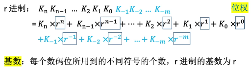
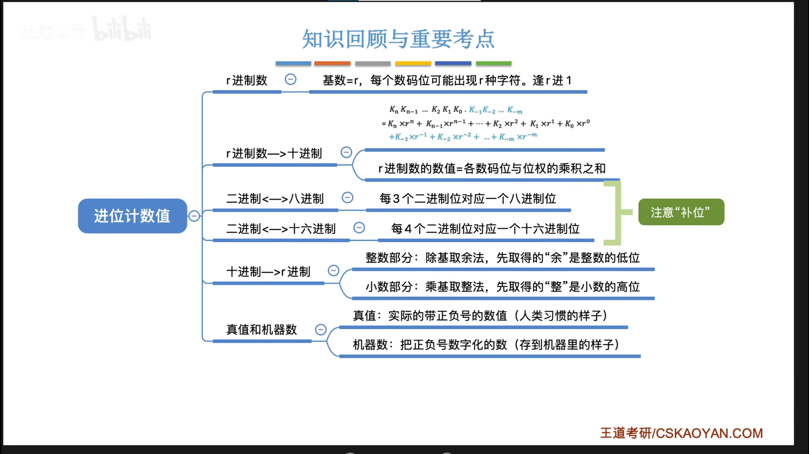
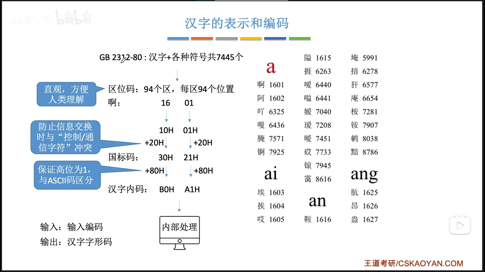
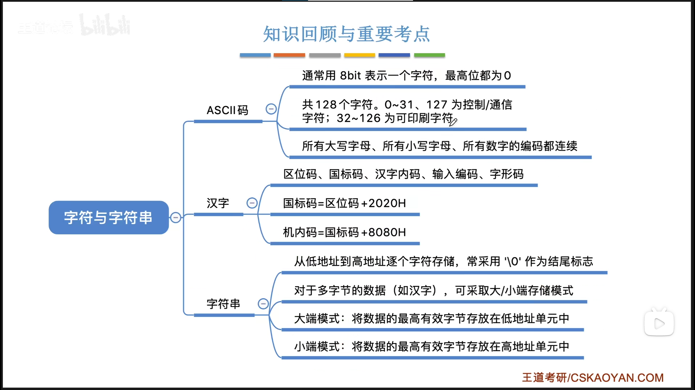

# 2.1.1 进位计数制
- 
- 2进制-->8进制
  - 3位一组
- 2进制-->16进制
  - 4位一组
- 8进制-->2进制
  - 每位8进制对应3位2进制
- 16进制-->2进制
  - 每位16进制对应4位2进制
- 10进制-->任意进制
  - 除积取余法
## 小结：

# 2.1.2 BCD码
- 处理加法运算：8421码超出范围时+6进位 补0
- 2421码：5和5之后的数第一位必须是1

# 2.1.3 字符与字符串
- ASCII码：可印刷字符：32~126，
  - 数字：0011为第一位，第二位是其8421码。  
    - 如：9 ASSCII码值为57(0011 1001) *0011*固定，*1001*为BCD码的9.
  - 大写字母：65(<u>010</u>0 0001)~90(<u>010</u>1 1010)
    - 下划线部分固定，剩下的5位二进制是从1到26，对应26个大写英文字母
  - 小写字母：97(<u>011</u>0 0001)~122(<u>011</u>1 1010)
    - 下划线部分固定，剩下的5位二进制是从1到26，对应26个小写英文字母
  - 汉字编码：
    
## 小结
