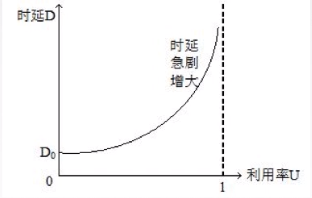
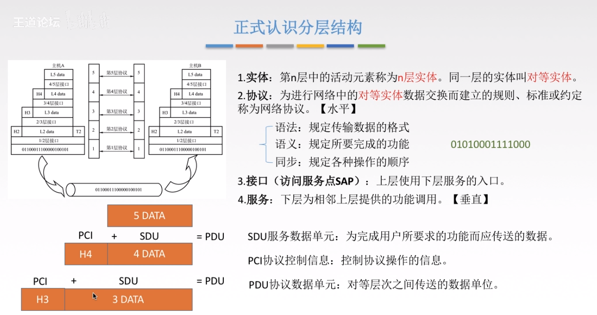

# 1.1.1计算机网络的概念功能组成
## 计算机网络的概念
- **计算机网络**：是一个将分散的，具有独立功能的计算机系统，通过通信设备（交换机、路由器）与线路连接起来，由功能完善的软件实现资源共享和信息传递的系统
- 计算机网络是互联的、自治的计算机集合
- 互联：互联互通 通信链路
- 自治：无主从关系
## 计算机网络的功能
1. 数据通信（连通性）
2. 资源共享
3. 分布式处理 Hadoop平台
4. 提高可靠性
5. 负载均衡
6. ......
## 计算机网络的组成
1. **组成部分** 硬件、软件、协议 
2. **工作方式** 
   - 边缘部分 用户直接使用（C/S方式，p2p方式）
   - 核心部分 为边缘部分服务
3. **功能组成**
   - 通信子网 实现数据通信
   - 资源子网 实现资源共享/数据处理
## 计算机网络的分类
1. **按分布范围**：广域网WAN 城域网MAN 局域网WAN 个人区域网PAN
2. **按使用者分**：公用网、专用网
3. **按交换技术分**：电路交换、报文交换、分组交换
4. **拓扑结构分**：总线型、星型（例如：6个节点，五条链路）、环形、网状型（广域网）
5. **按传输技术分**：
   - 广播式网络 共享公共通信信道
   - 点对点网络 使用分组存储转发和路由选择机制  

# 1.1.2标准化工作及相关组织
## 标准化工作
### 标准的分类
1. 法定标准
2. 事实标准
### RFC：因特网标准形式
### 相关组织:ISO,IEEE,IETF

# 1.1.3 速率相关的性能指标
## 速率
- 速率即数据率或称数据传输率或比特率
## 带宽: 
- 原本指某个信号具有的频带宽度,即最高频率与最低频率之差,单位是赫兹(Hz)
- 计算机网络中,带宽用来表示网络的通信线路传输数据的能力,通常是指单位时间从网络中的某一点到另一点所能通过的"最高数据率".单位是"比特每秒",b/s, kb/s, Mb/s, Gb/s. --- 网络设备所支持的最高速度
## 吞吐量
- 单位时间内通过某个网络的数据量.
- 受网络的带宽或网络的额定速率的限制.
## 时延
- 指数据从网络(或链路)的一端传送到另一端所需的时间.也叫延迟或迟延.单位是s.
- 时延: 发送时延(传输时延) 传播时延 排队时延 处理时延
  - 发送时延=数据长度 / 信道带宽(发送速率)
  - 传播时延=信道长度 / 电磁波在信道上传播的速率
  - 排队时延: 等待输出/入, 等待链路可用
  - 处理时延: 检错 找出口
## 时延带宽积
- 时延带宽积=传播时延 x 带宽
- 又称为以比特位单位的链路长度
## 往返时延RTT
- 从发送方发送数据开始,到发送方收到接收方的确认总共经历的时延
- RTT包括:
  - 往返传播时延=传播时延*2
  - 末端处理时间
## 利用率
- 利用率:
  - 信道利用率: 有数据通过时间/(有+无)数据通过时间
  - 网络利用率: 信道利用率加权平均值
  - 

# 1.2.1分层结构 协议 接口 服务
- 为什么要分层?
- 怎么分层?
- 正确认识分层结构
  
